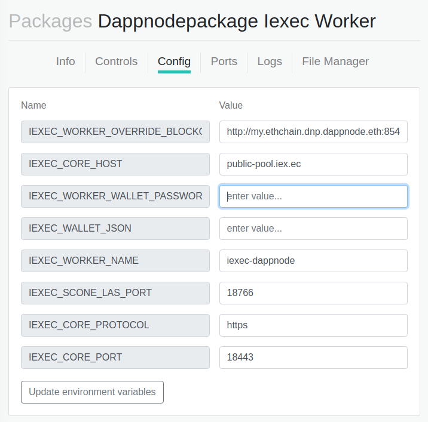

# iexec-worker-deploy

Dappnode package providing iExec Worker
It was generated using [DAppNodeSDK](https://github.com/dappnode/DAppNodeSDK)

It is possible to connect the worker to a light node.

No Aragon Package Manager Repo yet.

IPFS link:
- version 0.1.0 (worker 3.2.0): /ipfs/QmYp7tPSbPSUwSkqrAc2S4DdAQaypKBdNkhS3qLVHtuukQ
- version 0.2.0 (worker 4.0.0): /ipfs/QmRLnXygzuKhQMK28b8TDFtefLgFP1E361yDygvY7dDfLp

Or can use this package without installing it in your DAppNode following these instructions:

If IPFS is slow, add me as peer by clicking this link: http://my.dappnode/#/system/add-ipfs-peer/%2Fdns4%2F8c5b410aee162caa.dyndns.dappnode.io%2Ftcp%2F4001%2Fipfs%2FQmZuqWvtuXf1cjFYrQXGHJ8XdMBtwrEUnWmK2XbAcHwPSG

## Prerequisites

- git

   Install [git](https://git-scm.com/book/en/v2/Getting-Started-Installing-Git) commandline tool.

- docker

   Install [docker](https://docs.docker.com/engine/installation). The community edition (docker-ce) will work. In Linux make sure you grant permissions to the current user to use docker by adding current user to docker group, `sudo usermod -aG docker $USER`. Once you update the users group, exit from the current terminal and open a new one to make effect.

- docker-compose

   Install [docker-compose](https://docs.docker.com/compose/install)
   
**Note**: Make sure you can run `git`, `docker ps`, `docker-compose` without any issue and without sudo command.


## Buidling

`docker-compose build`

## Running

### Start

`docker-compose up -d`

Watch if your worker start is ok

### View logs

`docker-compose logs -f`

### Stop

`docker-compose down`

## Extra options

You can write extra options on the adminui or edit the `docker-compose.yml` and add extra options, such as:
```
 - EXTRA_OPTS=
```

# After install



Modify "IEXEC_WORKER_WALLET_PASSWORD" with your wallet password.
Modify "IEXEC_WALLET_JSON" with your minified iexec wallet file. (you can do it with `jq -c . < wallet.json`)
Change your worker name.

And click on "Update environment variables" to start worker on public-pool!

## License

This project is licensed under the GNU General Public License v3.0 - see the [LICENSE](LICENSE) file for details

